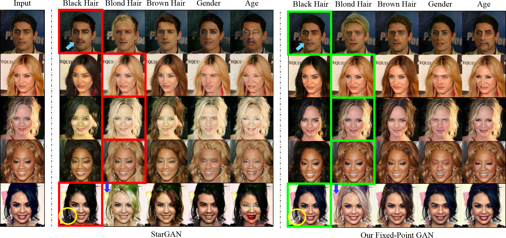
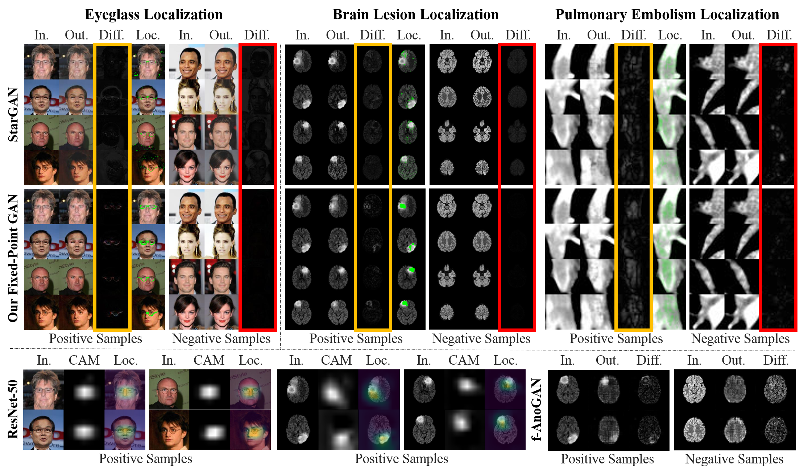

# Fixed-Point GAN 
This repository provides the official PyTorch implementation of Fixed-Point GAN. Fixed-Point GAN introduces fixed-point translation which dramatically reduces artifacts in image-to-image translation and introduces a novel method for disease detection and localization using image-level annotation only.




## Paper
[**Learning Fixed Points in Generative Adversarial Networks:<br/>From Image-to-Image Translation to Disease Detection and Localization**](https://arxiv.org/abs/1908.06965)

[Md Mahfuzur Rahman Siddiquee](https://github.com/mahfuzmohammad)<sup>1</sup>, [Zongwei Zhou](https://github.com/MrGiovanni)<sup>1,3</sup>, Nima Tajbakhsh<sup>1</sup>, Ruibin Feng<sup>1</sup>,<br/>
Michael B. Gotway<sup>2</sup>, Yoshua Bengio<sup>3</sup>, Jianming Liang<sup>1,3</sup><br/>

<sup>1</sup>Arizona State University; <sup>2</sup>Mayo Clinic; <sup>3</sup>Mila – Quebec Artificial Intelligence Institute<br/>
International Conference on Computer Vision ([ICCV](http://iccv2019.thecvf.com)), 2019

## Abstract
Generative adversarial networks (GANs) have ushered in a revolution in image-to-image translation. The development and proliferation of GANs raises an interesting question: can we train a GAN to remove an object, if present, from an image while otherwise preserving the image? Specifically, can a GAN "virtually heal" anyone by turning his medical image, with an unknown health status (diseased or healthy), into a healthy one, so that diseased regions could be revealed by subtracting those two images? Such a task requires a GAN to identify a minimal subset of target pixels for domain translation, an ability that we call fixed-point translation, which no GAN is equipped with yet. Therefore, we propose a new GAN, called Fixed-Point GAN, trained by (1) supervising same-domain translation through a conditional identity loss, and (2) regularizing cross-domain translation through revised adversarial, domain classification, and cycle consistency loss. Based on fixed-point translation, we further derive a novel framework for disease detection and localization using only image-level annotation. Qualitative and quantitative evaluations demonstrate that the proposed method outperforms the state of the art in multi-domain image-to-image translation and that it surpasses predominant weakly-supervised localization methods in both disease detection and localization.

## Usage

### 0. Create python environment
```bash
$ conda env create -f conda_env/conda_env_pytorch0.2.yml
$ source activate pytorch0.2
$ cat conda_env/pip_pytorch0.2.txt | xargs -n 1 pip install
```

### 1. Cloning the repository
```bash
$ git clone https://github.com/mahfuzmohammad/Fixed-Point-GAN.git
$ cd Fixed-Point-GAN/
```

### 2. Downloading the dataset
To download the CelebA dataset:
```bash
$ bash download.sh celeba
```

### 3. Training
```bash
$ python main.py --mode train --dataset CelebA --image_size 128 --c_dim 5 \
                 --sample_dir celeba/samples \
                 --log_dir celeba/logs \
                 --model_save_dir celeba/models \
                 --result_dir celeba/results \
                 --selected_attrs Black_Hair Blond_Hair Brown_Hair Male Young --lambda_id 10
```

### 3. Testing
```bash
$ python main.py --mode test --dataset CelebA --image_size 128 --c_dim 5 \
                 --sample_dir celeba/samples \
                 --log_dir celeba/logs \
                 --model_save_dir celeba/models \
                 --result_dir celeba/results \
                 --selected_attrs Black_Hair Blond_Hair Brown_Hair Male Young --lambda_id 10
```

## Citation
```
@inproceedings{siddiquee2019learning,
  title={Learning Fixed Points in Generative Adversarial Networks: From Image-to-Image Translation to Disease Detection and Localization},
  author={Siddiquee, Md Mahfuzur Rahman and Zhou, Zongwei and Tajbakhsh, Nima and Feng, Ruibin and Gotway, Michael B and Bengio, Yoshua and Liang, Jianming},
  booktitle={Proceedings of the IEEE International Conference on Computer Vision},
  pages={191--200},
  year={2019}
}
```

## Acknowledgements

This research has been supported partially by ASU and Mayo Clinic through a Seed Grant and an Innovation Grant, and partially by NIH under Award Number R01HL128785. The content is solely the responsibility of the authors and does not necessarily represent the official views of NIH. This repository has been built upon [yunjey/stargan](https://github.com/yunjey/stargan).
